# 1. Create a project map
[docs/CODEBASE_MAP.md](docs/CODEBASE_MAP.md)
# 2. Connect core tools through MCP
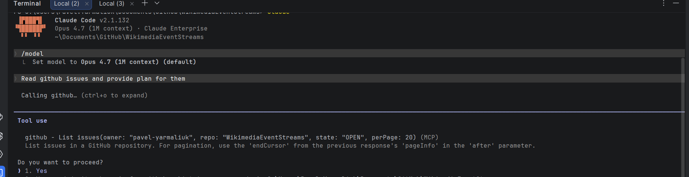
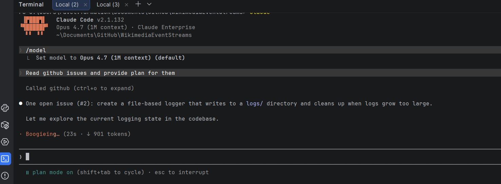
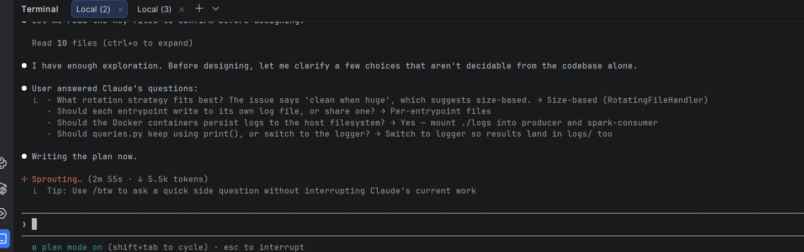
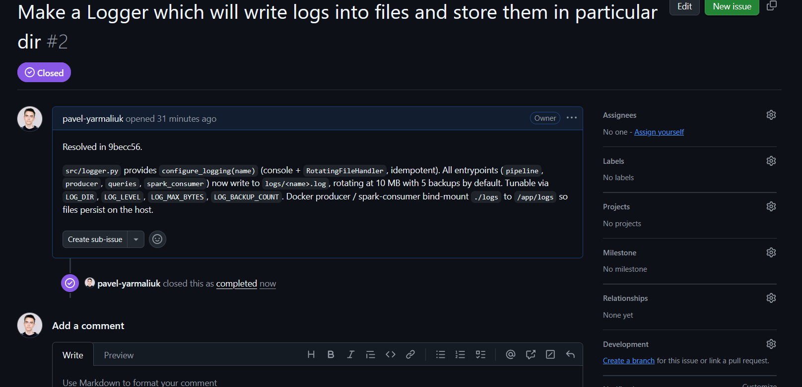
# 3. Refine the task for agent use
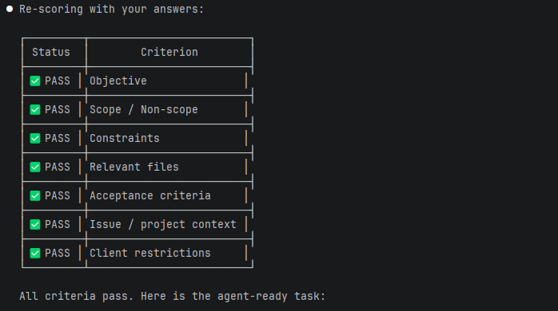
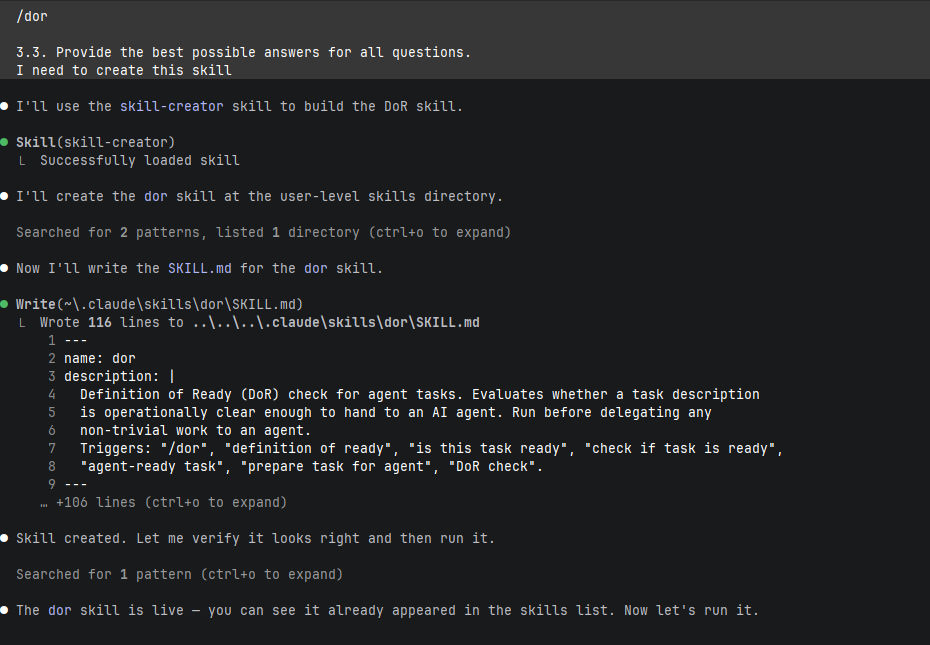
# 4. Use an agent to start planning & 5. Validate plan
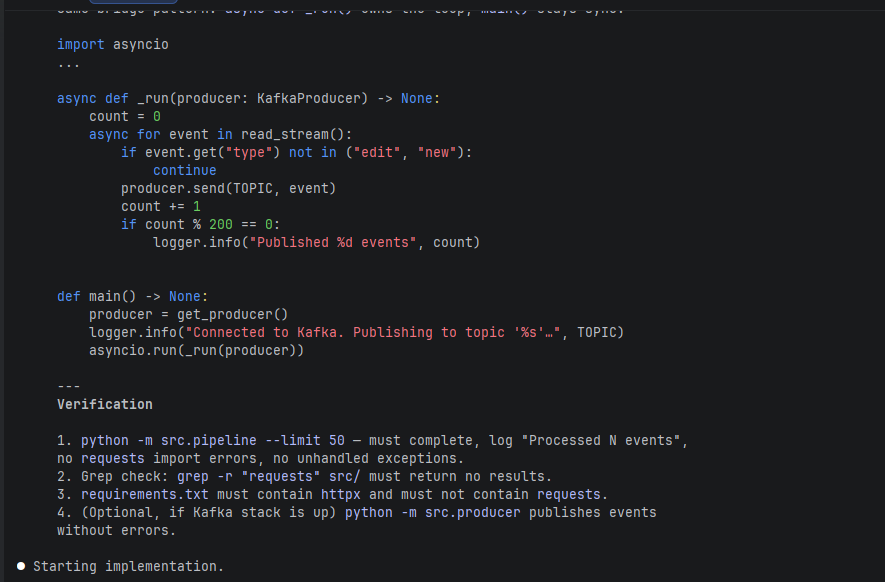
# 6. Test the feature 
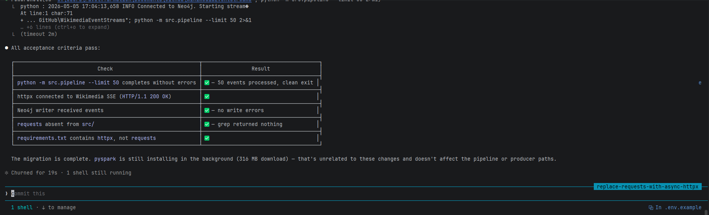
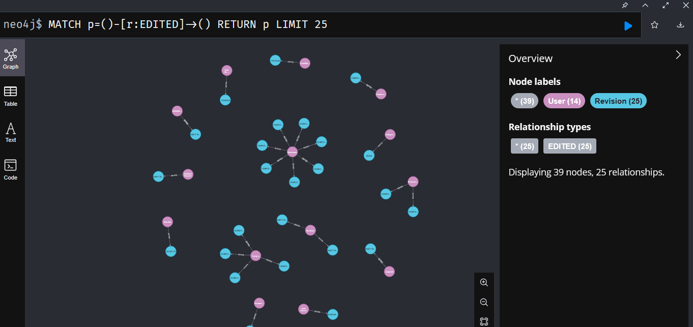
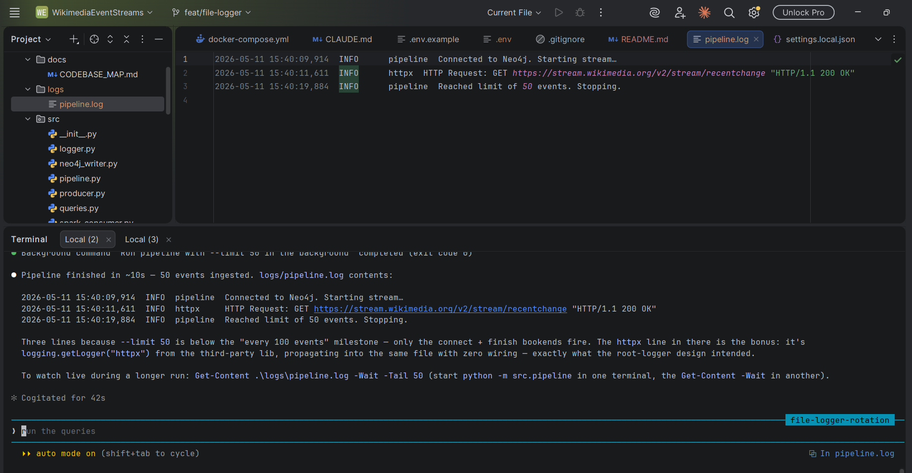
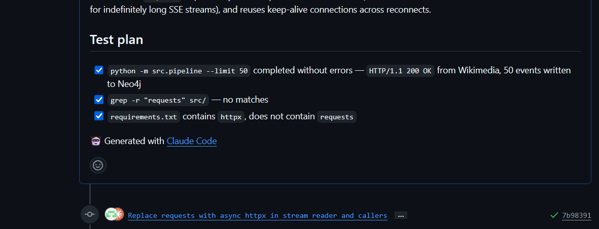
# 7. Automatic Code review on GitHub
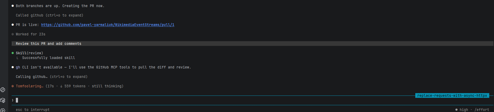
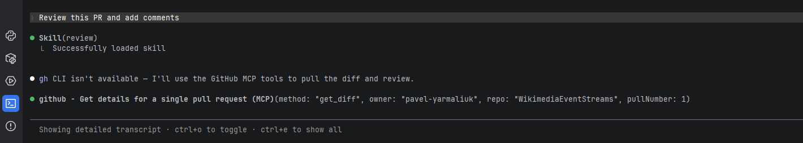
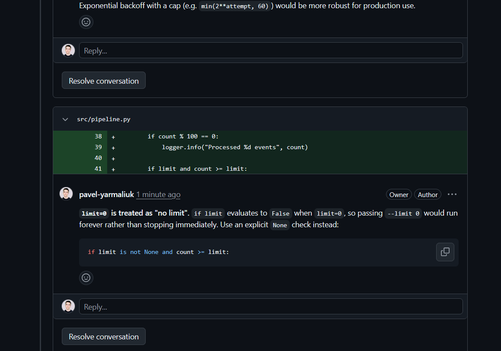
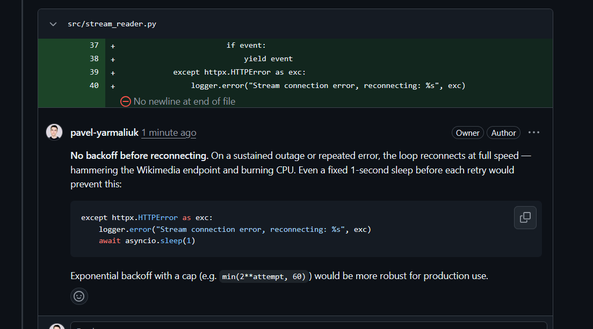
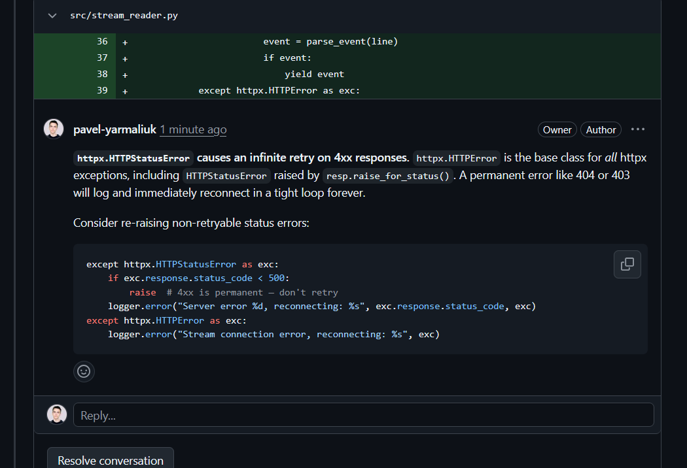
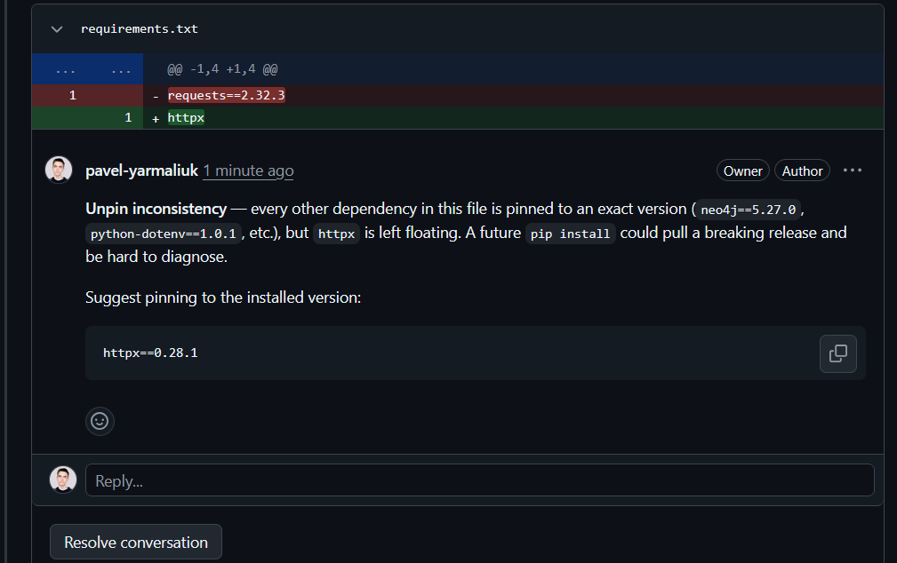
# 8. Perform manual code review
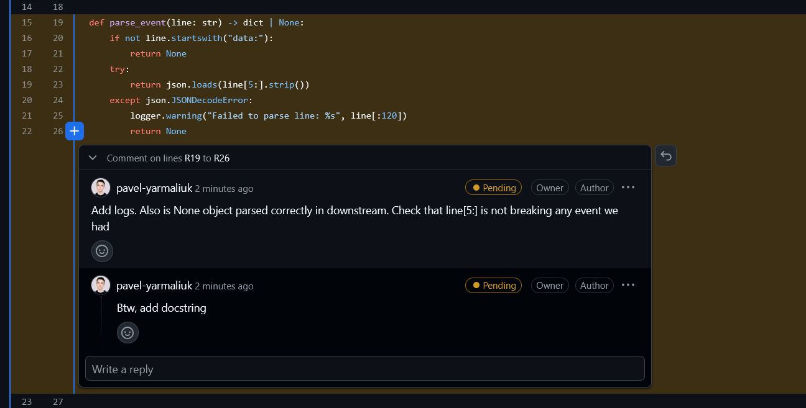
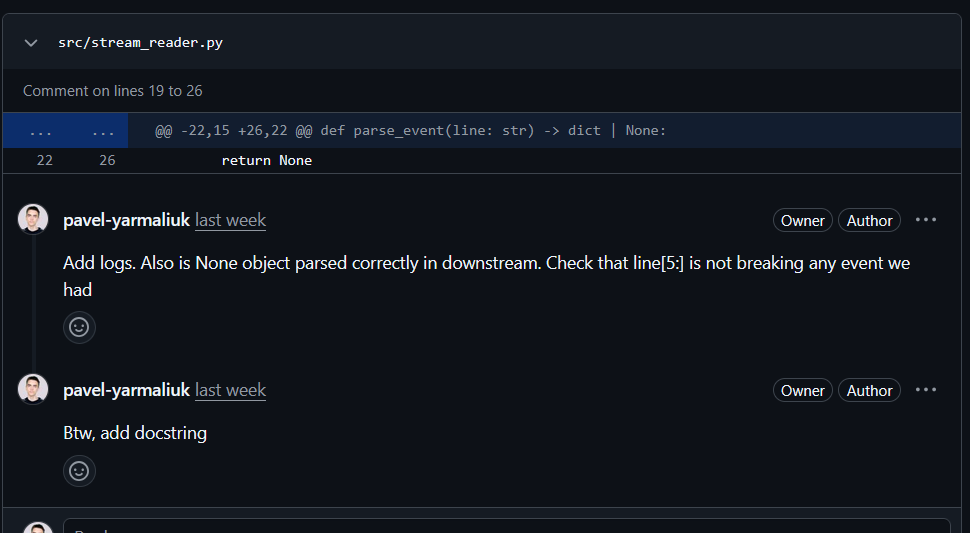
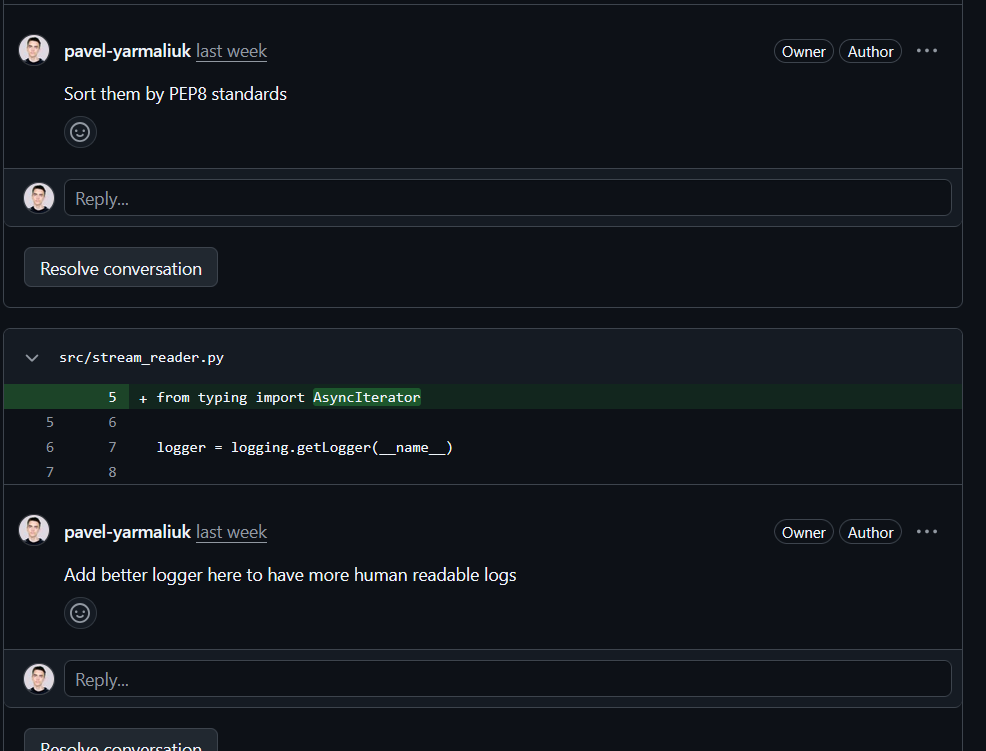