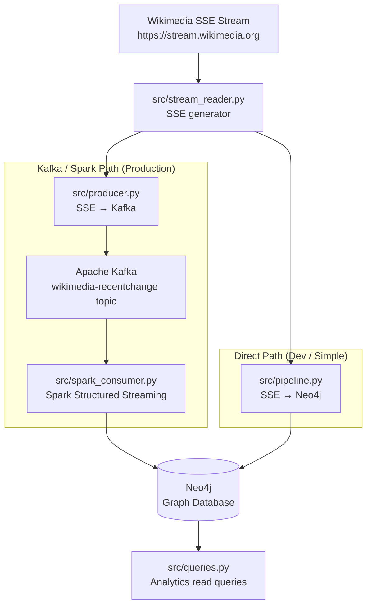
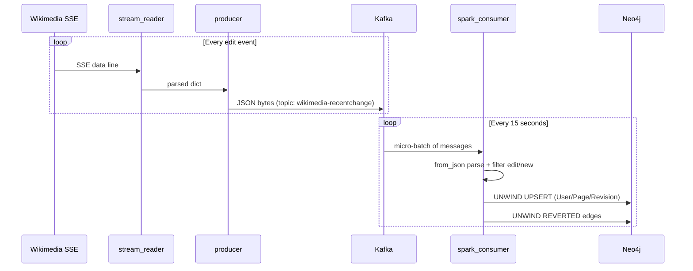

# Codebase Map

> Auto-generated by Cartographer. Last mapped: 2026-05-05T14:42:58Z

## System Overview

WikimediaEventStreams is a real-time pipeline that consumes Wikipedia edit events from the Wikimedia Server-Sent Events (SSE) API and stores them in a Neo4j graph database. The graph models `User`, `Page`, and `Revision` nodes with `EDITED`, `MODIFIES`, and `REVERTED` relationships.

There are **two write paths** to Neo4j — both share the same SSE reader:



## Directory Structure

```
WikimediaEventStreams/
├── src/                        # Python application code
│   ├── __init__.py             # Package marker (empty)
│   ├── stream_reader.py        # Wikimedia SSE infinite generator
│   ├── producer.py             # Entry point: SSE → Kafka
│   ├── pipeline.py             # Entry point: SSE → Neo4j (direct)
│   ├── spark_consumer.py       # Spark job: Kafka → Neo4j
│   ├── neo4j_writer.py         # Neo4j upsert wrapper (per-event)
│   └── queries.py              # Ad-hoc analytics Cypher runner
├── docs/
│   └── CODEBASE_MAP.md         # This file
├── .env.example                # Required env var template
├── .gitignore
├── docker-compose.yml          # Full-stack deployment (7 services)
├── Dockerfile                  # Image for producer / queries
├── Dockerfile.spark            # Image for spark-consumer
├── Makefile                    # docker compose convenience wrappers
└── requirements.txt            # Python deps for producer/pipeline/queries
```

## Module Guide

### `src/stream_reader.py`

**Purpose**: Connects to the Wikimedia SSE API and yields parsed JSON edit events as an infinite, auto-reconnecting **async** generator.

**Key exports**:
- `read_stream(url) -> AsyncIterator[dict]` — async generator; reconnects on transport errors and 5xx responses with a 1-second backoff; re-raises on 4xx (permanent errors)
- `parse_event(line) -> dict | None` — strips `data:` prefix and JSON-parses SSE lines; DEBUG-logs skipped non-data lines

**Dependencies**: `httpx` (`AsyncClient` with `_TIMEOUT` and `_LIMITS` module constants)

**Patterns**: Async generator; `httpx.AsyncClient` hoisted outside the reconnect loop so the connection pool (1 connection, 30 s keep-alive) survives reconnects; `connect=10 s` / `read=None` timeout.

**Gotchas**:
- `Last-Event-ID` resumption is not implemented; restarts always begin from the live position.
- `User-Agent` header hard-codes a personal GitHub URL — update if repo is forked.
- Callers must use `async for` — both `pipeline.py` and `producer.py` bridge to sync via `asyncio.run()`.

---

### `src/producer.py`

**Purpose**: Entry point for the Kafka path. Reads from `read_stream()` and publishes `edit`/`new` events to the `wikimedia-recentchange` Kafka topic.

**Key exports**:
- `get_producer(retries, delay) -> KafkaProducer` — creates a producer with retry logic
- `main()` — synchronously callable entry point; bridges to async via `asyncio.run(_run(producer))`
- `_run(producer)` — async inner loop that drives the `read_stream()` async generator

**Dependencies**: `stream_reader`, `kafka-python-ng`, `asyncio`

**Gotchas**:
- `producer.send()` is fire-and-forget; no `flush()` on exit — events may be lost on shutdown.
- Topic name is a hardcoded module constant; no env-var override.
- `KAFKA_BOOTSTRAP_SERVERS` is read at import time.

---

### `src/pipeline.py`

**Purpose**: Entry point for the direct path. Reads from `read_stream()` and writes each event to Neo4j via `Neo4jWriter` (no Kafka or Spark).

**Key exports**:
- `main(limit=None)` — synchronously callable; bridges to async via `asyncio.run(_run(limit, writer))`
- `_run(limit, writer)` — async inner loop that drives the `read_stream()` async generator

**Dependencies**: `stream_reader`, `neo4j_writer`, `python-dotenv`, `asyncio`

**Patterns**: `try/finally` ensures `writer.close()` even when `asyncio.run()` raises. CLI `--limit` flag for bounded runs; `limit=0` correctly stops immediately (`if limit is not None`).

**Gotchas**:
- `load_dotenv()` runs at import time, not inside `main()`.
- Missing `NEO4J_*` env vars raise `KeyError` immediately (fail-fast, raw traceback).
- Running concurrently with `spark_consumer.py` writes to the same Neo4j instance (safe due to `MERGE` idempotency, but `edit_count` could double-increment).

---

### `src/neo4j_writer.py`

**Purpose**: Thin Neo4j driver wrapper that upserts Wikipedia edit events as graph nodes/relationships (one session per event).

**Key exports**:
- `Neo4jWriter(uri, user, password)` — class with `write_event(event)` and `close()`

**Cypher operations**:
- `_UPSERT_EDIT` — `MERGE`-based upsert for `User`, `Page`, `Revision` nodes and `EDITED`/`MODIFIES` relationships
- `_MARK_REVERT` — Adds `REVERTED` relationship when `revision.old != revision.new`

**Gotchas**:
- One session opened/closed per event — not a throughput bottleneck since the driver's connection pool is reused, but less efficient than batch writes.
- `_MARK_REVERT` fires for all edits with a prior revision, not just actual wiki reverts — the naming is misleading.
- `user_id` and `username` are both set from the same `"user"` field; no numeric ID captured.
- No explicit Neo4j constraint/index creation — relies on auto-indexing from `MERGE`.

---

### `src/spark_consumer.py`

**Purpose**: Standalone PySpark Structured Streaming job. Reads from Kafka, parses events with a defined schema, and bulk-writes batches to Neo4j using `UNWIND` Cypher.

**Key internals**:
- `write_batch(batch_df, epoch_id)` — `foreachBatch` callback; collects batch to driver, runs two `UNWIND` Cypher queries per batch
- `_get_driver()` — lazy singleton Neo4j driver (module-level global)
- `event_schema` — `StructType` defining the JSON shape (user, title, page_id, namespace, type, timestamp, comment, revision.{old,new})

**Cypher operations**:
- `_UPSERT_BATCH` — `UNWIND $events AS e` — one round-trip for the whole batch
- `_REVERT_BATCH` — `UNWIND $pairs AS p` — bulk revert edge creation

**Configuration**: 15-second micro-batch trigger; checkpoint at `/tmp/wikimedia-checkpoint`; `startingOffsets: "latest"`.

**Gotchas**:
- Module-level code (Spark initialization, `readStream`) runs at import time — cannot be safely unit-tested without triggering Spark.
- Checkpoint is in the container's ephemeral `/tmp` — lost on restart, resets to `latest` (events during downtime are skipped).
- `rev_id = f"epoch-{epoch_id}"` fallback for null `revision.new` causes collisions within a batch.
- Kafka connector JAR (`spark-sql-kafka-0-10_2.12:3.5.8`) is downloaded at runtime from Maven on first start.

---

### `src/queries.py`

**Purpose**: Ad-hoc analytics script. Runs three read-only Cypher queries and prints results to stdout.

**Queries**:
- `TOP_EDITORS` — top 5 users by revision count
- `MOST_REVERTED_PAGES` — top 10 pages by inbound `REVERTED` relationships
- `COLLABORATION_PAIRS` — top 10 user pairs who co-edited the same pages

**Key exports**:
- `run_query(driver, title, cypher)` — pretty-printer for query results
- `main()` — connects and runs all queries; invoked via `make queries`

**Gotchas**:
- `MOST_REVERTED_PAGES` results are inflated because `REVERTED` edges are created for all edits with a prior revision, not only actual wiki reverts.
- `driver.close()` is not wrapped in `try/finally` — skipped on query failure.
- No indexes — `COLLABORATION_PAIRS` traversal may be slow on large graphs.

---

## Infrastructure

| Service | Image | Role |
|---|---|---|
| `zookeeper` | `confluentinc/cp-zookeeper:7.6.1` | Kafka coordination |
| `kafka` | `confluentinc/cp-kafka:7.6.1` | Message broker |
| `neo4j` | `neo4j:5.18-community` | Graph database |
| `spark-master` | `apache/spark:3.5.8-python3` | Spark cluster master |
| `spark-worker` | `apache/spark:3.5.8-python3` | 1G RAM / 2-core worker |
| `producer` | Built from `Dockerfile` | SSE → Kafka publisher |
| `spark-consumer` | Built from `Dockerfile.spark` | Kafka → Neo4j via Spark |

## Data Flow (Kafka/Spark Path)



## Environment Variables

| Variable | Used By | Default | Notes |
|---|---|---|---|
| `NEO4J_URI` | `pipeline.py`, `queries.py`, `spark_consumer.py` | `bolt://localhost:7687` | Bolt or `neo4j+s://` for AuraDB |
| `NEO4J_USER` | same | `neo4j` | |
| `NEO4J_PASSWORD` | same | `password` | |
| `KAFKA_BOOTSTRAP_SERVERS` | `producer.py`, `spark_consumer.py` | `localhost:9092` | Comma-separated `host:port` |

## Conventions

- All Python modules use `logging` (not `print`) for operational output; format includes `%(name)s` so each log line identifies its originating module.
- Neo4j writes use `MERGE` for idempotency — safe to replay events.
- `stream_reader.py` is the single SSE abstraction; both entry points import it via `async for`.
- Async/sync boundary: `read_stream` is async; callers bridge with `asyncio.run()` in their sync `main()`, keeping public entry points synchronously callable.
- Cypher query strings are module-level constants (uppercase names).
- `spark_consumer.py` is intentionally self-contained (does not import `neo4j_writer.py`) for `spark-submit` compatibility.
- Third-party imports are separated from stdlib imports by a blank line (PEP 8).

## Gotchas

1. **`REVERTED` edges are not true reverts** — they are created for any edit that has a prior revision.
2. **No Neo4j indexes/constraints** defined in code — production use requires explicit `CREATE CONSTRAINT` statements.
3. **Spark checkpoint is ephemeral** — `/tmp/wikimedia-checkpoint` is lost on container restart; stream resets to `latest`, skipping events.
4. **Kafka JAR fetched at runtime** — first `spark-consumer` start requires internet access; subsequent restarts re-download if the container is recreated.
5. **Two write paths can race** — running `pipeline.py` and `spark_consumer.py` simultaneously is safe (MERGE is idempotent) but `edit_count` may double-count.
6. **`Last-Event-ID` not implemented** in `stream_reader.py` — reconnects always resume from the live stream position, not the last received event.

## Navigation Guide

**To add a new graph relationship type**: Edit `neo4j_writer.py` (`_UPSERT_EDIT` / `_MARK_REVERT`) and `spark_consumer.py` (`_UPSERT_BATCH` / `_REVERT_BATCH`).

**To add a new analytics query**: Add a Cypher constant and a `run_query` call in `src/queries.py`.

**To change the Kafka topic**: Update the `TOPIC` constant in `src/producer.py` and `spark_consumer.py`, and the `KAFKA_AUTO_CREATE_TOPICS_ENABLE` setting in `docker-compose.yml`.

**To switch to AuraDB (cloud Neo4j)**: Change `NEO4J_URI` to `neo4j+s://<host>` (see `.env.example` comments) and set credentials accordingly.

**To run a bounded test ingestion**: `python -m src.pipeline --limit 500`

**To watch all service logs**: `make logs`

**To tear down everything including volumes**: `make clean`